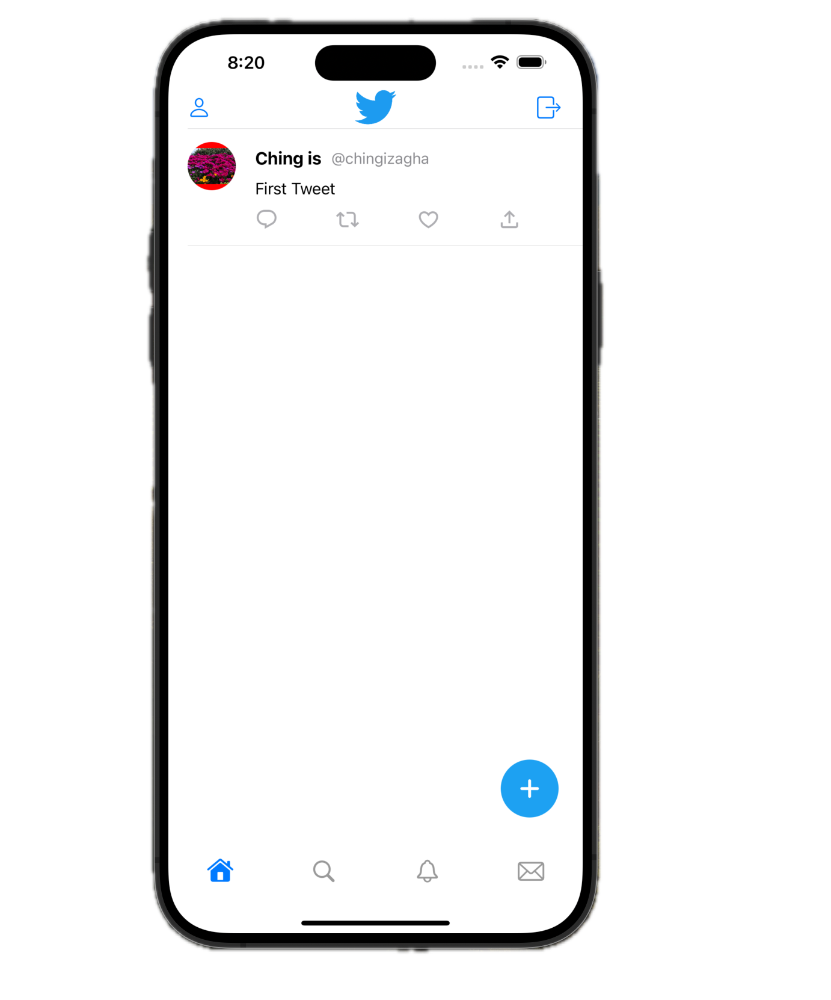
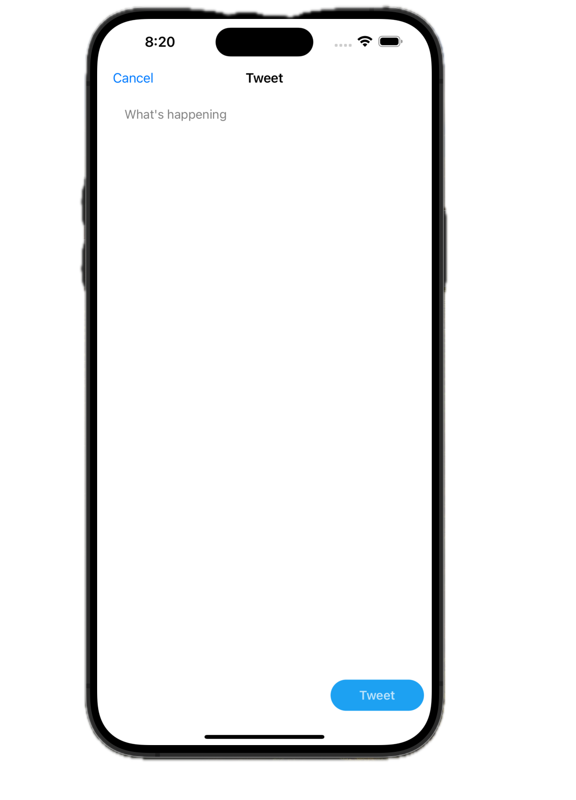
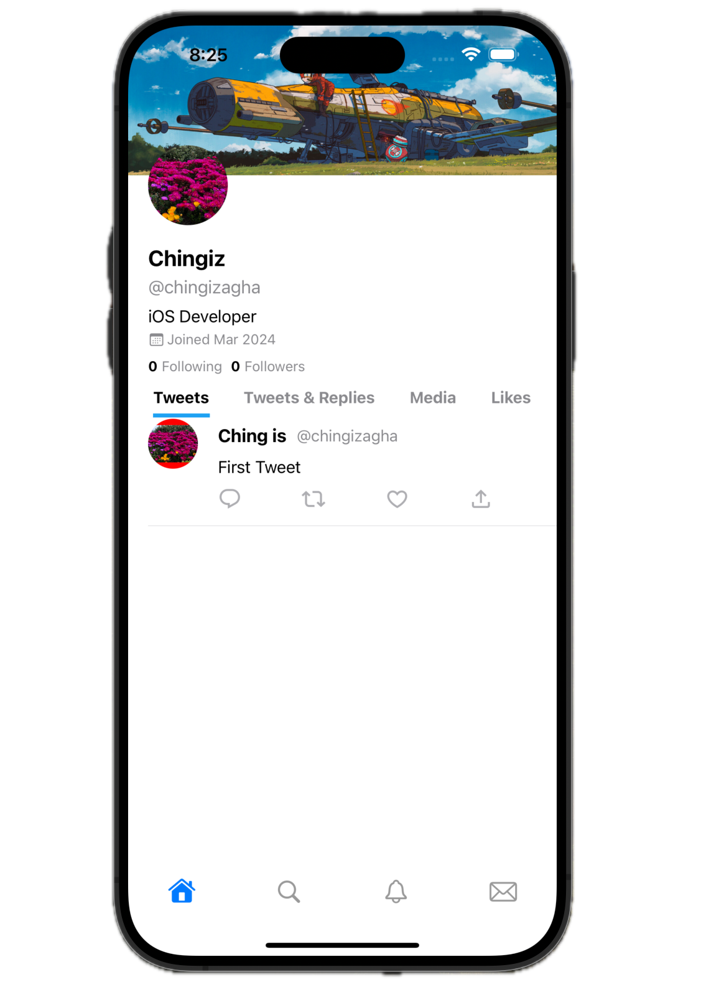

# Twitter Clone App

Full featured universal (iOS, iPadOS) app.

    
    
    

## Overview
- Written in Swift
- Uses UIKit 
- Designed with MVVM pattern
- Pagination Support for data
- Auto layout Based
- Universal App: Run on iPhone and iPad
- Built in Xcode 15
- Using Firebase as Database and Storage

## Design

The app has three area:

1. Home View
2. Tweet Section
3. Profile Section

